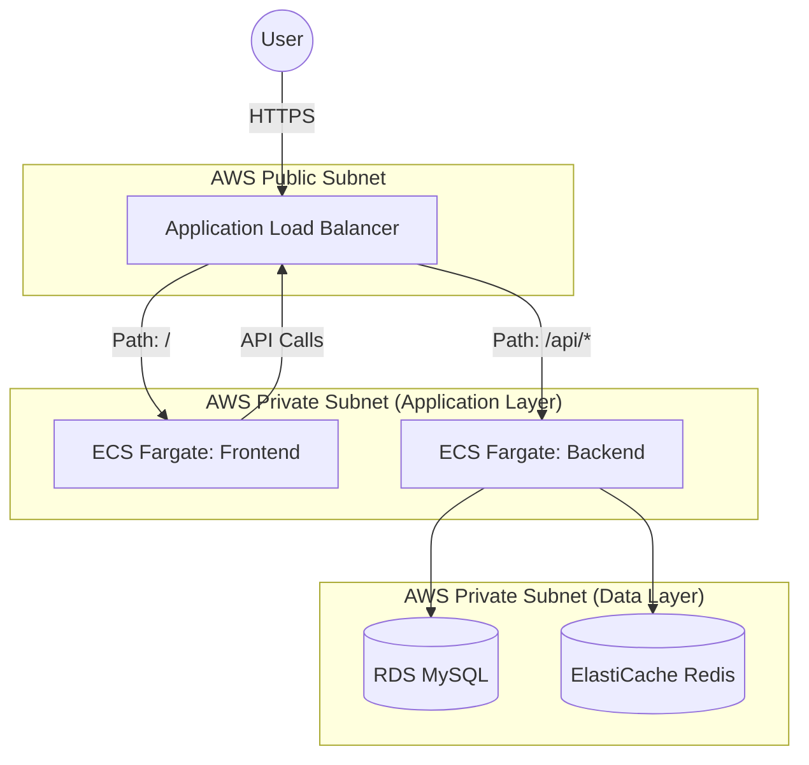

# 🚀 Zenith Todo App - Complete Project Information

This document contains the License, System Architecture, AWS Deployment Guide, and Commit Standards for the Zenith Todo App.

## 🏗️ 1. System Architecture

The Zenith Todo App follows a modern, containerized microservices-lite architecture.

### 🧩 Components:
1.  **Frontend (React)**: A SPA built with React 18, Zustand, and React Query. Served via Nginx.
2.  **Backend (Node.js/Express)**: A RESTful API following the Controller-Service-Repository pattern.
3.  **Database (MySQL)**: Persistent storage for users and todos.
4.  **Cache/Queue (Redis)**: Used for session storage, rate limiting, and BullMQ background jobs.

### 🗺️ Architecture Diagram (Production/AWS):



---

## ☁️ 2. AWS Cloud Deployment Guide

To run this project on AWS, we recommend using **Amazon ECS (Elastic Container Service)** with **Fargate**.

### 🪜 Step-by-Step Deployment:

#### 1. Setup Data Layer
- **RDS (MySQL)**: Create a MySQL instance. Ensure it's in a private subnet and allow traffic from the ECS security group on port 3306.
- **ElastiCache (Redis)**: Create a Redis cluster. Allow traffic from ECS on port 6379.

#### 2. Containerize & Push to ECR
- Create two repositories in **Amazon ECR**: `zenith-backend` and `zenith-frontend`.
- Build and push your images:
  ```bash
  # Backend
  aws ecr get-login-password --region <region> | docker login --username AWS --password-stdin <aws_account_id>.dkr.ecr.<region>.amazonaws.com
  docker build -t zenith-backend ./backend
  docker tag zenith-backend:latest <aws_account_id>.dkr.ecr.<region>.amazonaws.com/zenith-backend:latest
  docker push <aws_account_id>.dkr.ecr.<region>.amazonaws.com/zenith-backend:latest

  # Frontend
  docker build -t zenith-frontend ./frontend
  docker tag zenith-frontend:latest <aws_account_id>.dkr.ecr.<region>.amazonaws.com/zenith-frontend:latest
  docker push <aws_account_id>.dkr.ecr.<region>.amazonaws.com/zenith-frontend:latest
  ```

#### 3. Create ECS Task Definitions
- Define environment variables for the **Backend** task:
    - `DB_HOST`: Your RDS Endpoint
    - `REDIS_HOST`: Your ElastiCache Endpoint
    - `JWT_ACCESS_SECRET`: (Use AWS Secrets Manager)
    - `JWT_REFRESH_SECRET`: (Use AWS Secrets Manager)
- Define the **Frontend** task to point to the Backend's Load Balancer URL.

#### 4. Configure Load Balancer (ALB)
- Create an ALB.
- Create Target Groups for both Frontend (Port 80) and Backend (Port 4000).
- Configure Listener Rules:
    - `PATH /api/*` -> Forward to Backend Target Group.
    - `DEFAULT` -> Forward to Frontend Target Group.

#### 5. Run ECS Services
- Create an ECS Cluster.
- Create Services for both Backend and Frontend using Fargate.
- Map them to the corresponding Target Groups in the ALB.

---

## 📝 4. Commit Standards (commit.md)

### Standards
- Use [Conventional Commits](https://www.conventionalcommits.org/en/v1.0.0/)
- `feat`: New feature
- `fix`: Bug fix
- `docs`: Documentation changes
- `style`: Formatting/Style
- `refactor`: Code restructuring
- `chore`: Maintenance

### Format
`<type>(<scope>): <subject>`
Example: `feat(auth): add JWT rotation`

---

## 🚀 5. How to Run (Local)

1.  **Clone**: `git clone <repo-url>`
2.  **Docker**: `docker compose up --build`
3.  **Access**: 
    - Frontend: `http://localhost:3000`
    - Backend API: `http://localhost:4000`
    - Queue Admin: `http://localhost:4000/admin/queues`

---
📝 _Generated for Zenith Production Excellence._
